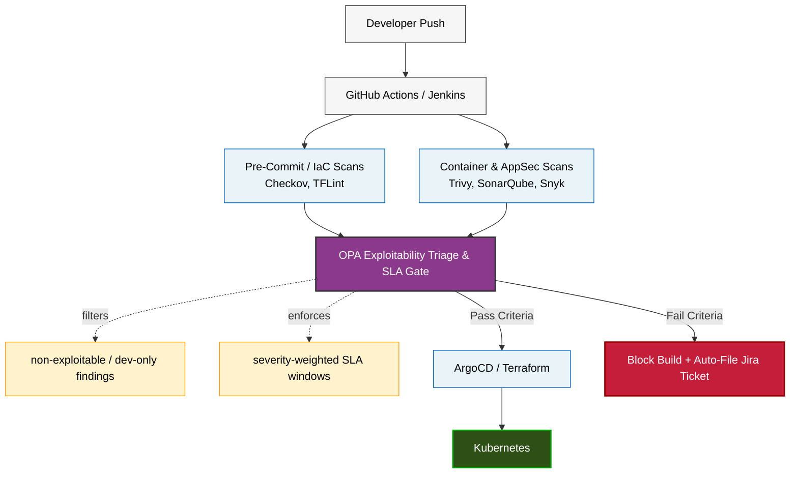
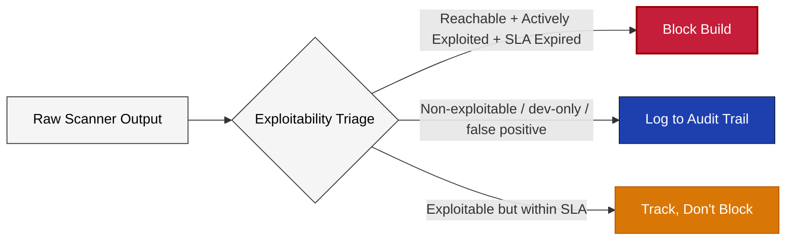
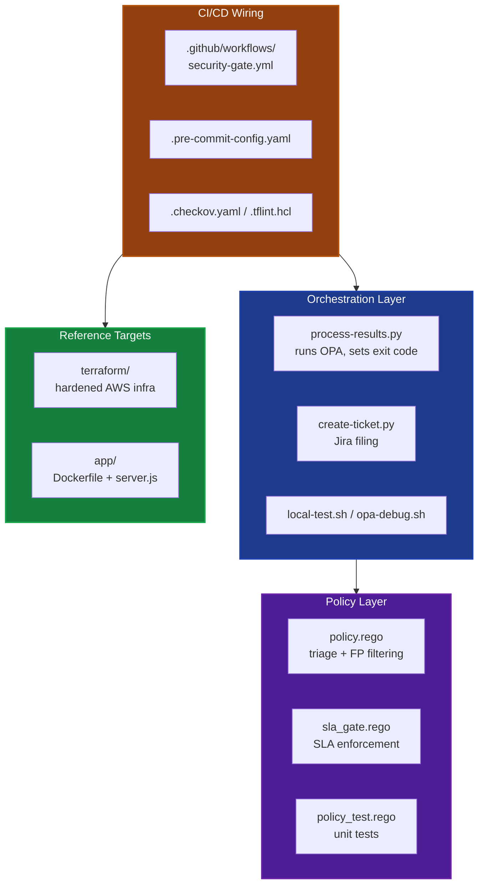
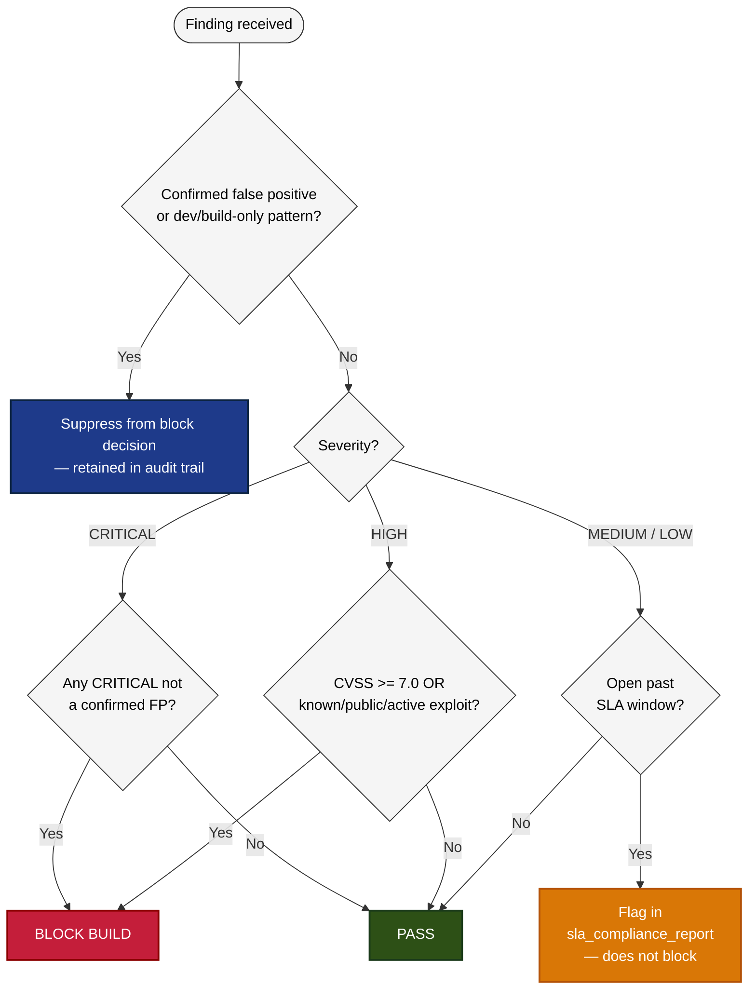
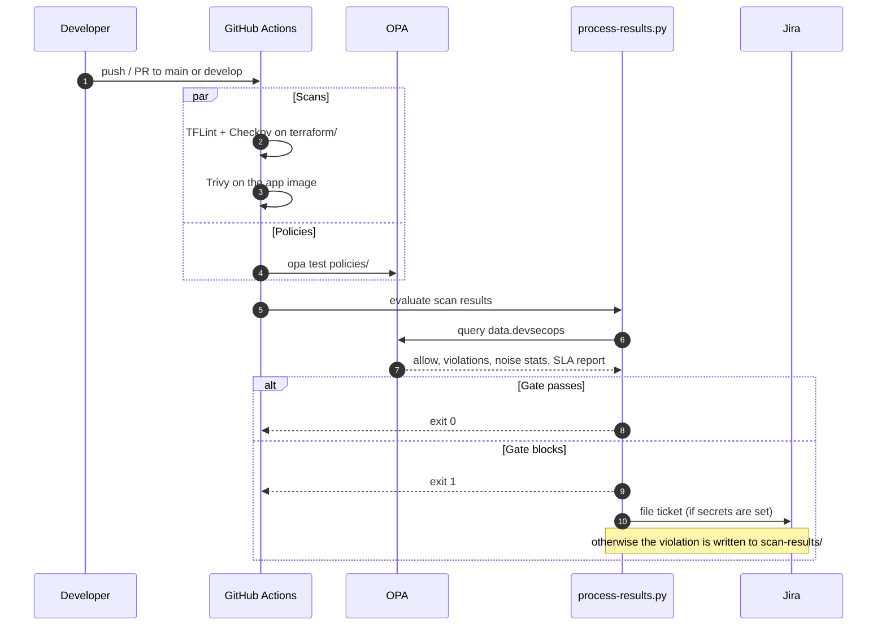
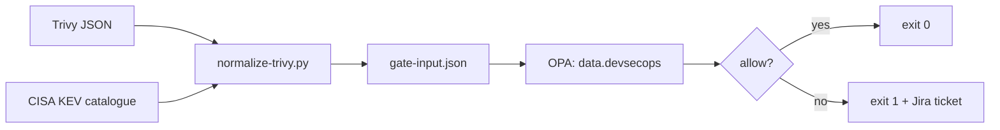

# Enterprise Shift-Left CI/CD & Governance Gateway

[](https://github.com/kinuthia-mark/Devsec-gate/actions/workflows/security-gate.yml)


A centralized security gating framework that filters vulnerability noise by **exploitability** rather than raw alert volume, enforces severity-weighted SLA windows, and blocks unverified builds before they reach production Kubernetes — without burying developers in false positives.

The policies, scripts and workflow have no project-specific paths, so the same gate can be copied into any repository's pipeline.

---

## The Problem

Rolling out security scanning across dozens of repositories is rarely a tooling problem — it's a trust problem. If a build breaks on a low-risk, non-exploitable finding, developers learn to route around the gate instead of fixing what matters. That erodes the control entirely.

This project resolves that by inserting an **Open Policy Agent (OPA) triage layer** between raw scanner output and the pass/fail decision, so only findings with a real exploit path and an expired SLA window actually block a build.

## Architecture



### Threat model this addresses

| Threat | Control that stops it |
|---|---|
| **Unauthorized commit bypasses** — merges that skip local validation and land misconfigured IaC on `main` | Pre-commit gate + CI pipeline |
| **Unverified container images** — untagged or unscanned base images entering the build path | Trivy scan step in CI |
| **Configuration drift** — permissive IAM roles, public S3 buckets, open ingress rules reaching production | Checkov + TFLint + OPA gate |
| **SLA drift** — known-exploitable CVEs aging past their remediation window due to fragmented tracking | `sla_gate.rego` + Jira auto-filing |

### Why exploitability, not CVSS volume

Gating on raw CVE count or CVSS score alone produces high theoretical coverage but crushes throughput — most flagged CVEs are unreachable in practice (test-only dependencies, unexercised code paths, already-patched transitive deps). The OPA layer instead asks: *is this reachable, is it actively exploited, and has it been open too long?* Findings that fail all three are still logged (for audit) but don't block the pipeline.



**Measured on the included data:** on `fixtures/scan-blocked.json` the gate suppresses 2 of 3 findings as dev-only or build-only noise (67%) and blocks only on the actively exploited CRITICAL. On `fixtures/trivy-sample.json` it suppresses the dev-only HIGH and blocks on the CVE listed in CISA KEV. Both results are asserted by the test suite, so the numbers stay true as the policy changes.

## Repository layout



```
.
├── .github/workflows/security-gate.yml   # CI: policy tests, IaC scan, container scan, gate
├── policies/
│   ├── policy.rego                       # Exploitability triage + false-positive filtering
│   ├── sla_gate.rego                     # Severity-weighted SLA enforcement
│   └── policy_test.rego                  # OPA unit tests for both policy files
├── fixtures/
│   ├── scan-blocked.json                 # Sample scan the gate must block
│   ├── scan-clean.json                   # Sample scan the gate must pass
│   ├── trivy-sample.json                 # Sample raw Trivy report for the converter tests
│   └── kev-sample.json                   # Sample CISA KEV catalogue
├── tests/
│   └── test_scripts.py                   # pytest: converter, gate end to end, Jira fallback
├── scripts/
│   ├── normalize-trivy.py                # Converts real Trivy JSON (+ CISA KEV) into gate input
│   ├── process-results.py                # Runs OPA, renders the triage report, sets exit code
│   ├── create-ticket.py                  # Files a Jira ticket on gate failure (env-var driven)
│   ├── local-test.sh                     # One-shot local pipeline dry run
│   └── opa-debug.sh                      # Rego syntax check + raw policy query
├── terraform/
│   ├── main.tf                           # Reference AWS infra (hardened: private, encrypted, least-privilege)
│   ├── variables.tf
│   └── outputs.tf
├── app/
│   ├── Dockerfile                        # Reference Node.js container for Trivy scanning
│   ├── package.json
│   └── server.js
├── .checkov.yaml                         # Checkov ruleset for IaC scanning
├── .tflint.hcl                           # TFLint ruleset for Terraform
├── .pre-commit-config.yaml               # Runs TFLint and Checkov before each commit
├── .gitignore
├── LICENSE
└── README.md                             # This file
```

## Policy logic

`policies/policy.rego` and `policies/sla_gate.rego` share the `devsecops` package, so a single query against `data.devsecops` returns the allow decision, the violations, the noise statistics and the SLA report together:



- **Blocking rule:** any `CRITICAL` finding that is not a confirmed false positive blocks. A `HIGH` finding blocks only if it is also exploitable (`cvss_score >= 7.0`, or a known, public or active exploit flag is set). `MEDIUM` and `LOW` never block on their own.
- **Noise filtering:** a finding is a false positive if its description contains `"dev dependency only"`, `"test dependency only"`, `"build-time only"` or `"not in executable path"`, if it is flagged `false_positive: true`, or if it is a `LOW` under CVSS 4.0 with no exploit. Packages the team has reviewed can be listed in `excluded_packages` as `"name:version"`. Both are left out of the block decision but kept in the audit trail through `noise_statistics` and `violation_report`.
- **SLA enforcement:** each severity gets its own remediation window. Any finding that is not a false positive and has been open past its window shows up in `sla_compliance_report.violations_detail`.
- **Fail closed:** if OPA cannot evaluate the policies (missing binary, syntax error), `process-results.py` treats the result as a block.

| Severity | SLA Window |
|---|---|
| CRITICAL | 3 days |
| HIGH | 7 days |
| MEDIUM | 14 days |
| LOW | 30 days |

## Running in GitHub Actions

The workflow (`.github/workflows/security-gate.yml`) runs on every push and pull request to `main` or `develop`. It has five jobs:

| Job | What it does | Fails when |
|---|---|---|
| **OPA policy unit tests** | `opa check`, `opa fmt --fail` and `opa test policies/` | A policy has a syntax error, is not formatted, or a test fails |
| **Python script tests** | `pytest tests/`: the Trivy converter, the gate end to end on every fixture, and the Jira fallback | Any script behaves differently from its tests |
| **Terraform lint and Checkov** | `terraform fmt` and `validate`, TFLint with the AWS ruleset, Checkov with `.checkov.yaml` | The reference infrastructure breaks a lint rule or a selected Checkov check |
| **Scan the container and gate on real findings** | Builds `app/`, scans it with Trivy, downloads the live CISA KEV catalogue, converts the report with `normalize-trivy.py` and runs the gate on it | The real image has a finding the policy says must block |
| **Exploitability gate** | Runs `process-results.py` on both fixtures | The clean scan is blocked, or the scan with an exploitable CRITICAL is let through |

The container job is the full shift-left pipeline on a real artifact: **scanner → normaliser → OPA → pass or block**. Its Trivy report and the gate's decision are uploaded as the `container-scan` artifact.



The triage report and violation log are uploaded as the `security-gate-report` artifact on every run.

**Optional repository secrets for Jira:**
- `JIRA_URL`: base URL of your Jira instance
- `JIRA_USER`: Jira username or email
- `JIRA_TOKEN`: Jira API token
- `JIRA_PROJECT_KEY`: Jira project key (for example `DEVSECOPS`)

Without these secrets the gate still runs and blocks correctly. Violations are written to `scan-results/security-gate-violations.log.json` instead.

## Gating real scanner output

`scripts/normalize-trivy.py` turns a Trivy JSON report into the schema the policies read, so the same gate works on a real image:

```bash
trivy image --format json -o trivy.json my-app:latest
curl -fsSL -o kev.json https://www.cisa.gov/sites/default/files/feeds/known_exploited_vulnerabilities.json
python3 scripts/normalize-trivy.py trivy.json --kev kev.json -o scan-results/gate-input.json
python3 scripts/process-results.py scan-results/gate-input.json
```



How the converter fills each field:

| Gate field | Source in the Trivy report |
|---|---|
| `id`, `package_name`, `package_version` | `VulnerabilityID`, `PkgName`, `InstalledVersion` |
| `severity` | `Severity` (`UNKNOWN` becomes `LOW`) |
| `cvss_score` | Highest V3 score across all CVSS sources, else V2, else a default for the severity |
| `description` | `Title`, plus `no fix available` when there is no `FixedVersion` and `dev dependency only` for packages Trivy marks as development dependencies (which the policy then suppresses) |
| `discovered_date` | `PublishedDate`. This is conservative: the SLA clock starts when the CVE became public, not when your scanner first saw it |
| `exploit_available`, `public_exploit`, `active_exploitation` | `true` when the CVE is in the CISA Known Exploited Vulnerabilities catalogue |

The same CVE reported by two targets in one image (for example the OS layer and a lock file) is counted once.

## Running locally

**Prerequisites:**
- [OPA](https://www.openpolicyagent.org/docs/latest/#running-opa) (`opa` command must be in `PATH`)
- Python 3.11+
- Docker (optional, for container scanning)
- Checkov and TFLint (optional, for IaC scanning)

**Policy unit tests and script tests:**

```bash
opa test policies/ -v
python -m pytest tests/ -v
```

The tests cover the block rules for every severity, false positive and excluded package handling, the noise statistics (including an empty scan) and the SLA windows.

**Quick test against the bundled fixtures:**

```bash
python3 scripts/process-results.py fixtures/scan-blocked.json
```

Expected result: the gate **blocks**, exit code 1. The fixture has one unmitigated `CRITICAL` (`CVE-2021-12345`, actively exploited, 13 days open against a 3-day SLA). The `HIGH` and `MEDIUM` findings are suppressed as dev-only and build-only false positives, so the report shows 1 actionable finding out of 3 and a 67% noise reduction.

```text
Scanned findings : 3
Actionable        : 1
False positives   : 2
Excluded packages : 0
Noise reduction   : 67%

SLA status        : VIOLATED
SLA compliance    : 67%
  [SLA BREACH] CVE-2021-12345 (CRITICAL) in 'node' - 10d over the 3d window

--- POLICY VIOLATIONS (blocking) ---
  [FAIL] CRITICAL vulnerability detected - must be remediated

Gate decision: BLOCK
```

```bash
python3 scripts/process-results.py fixtures/scan-clean.json
```

Expected result: the gate **passes**, exit code 0. The `HIGH` is a test-only dependency, the `MEDIUM` is inside its 14-day window and the `LOW` scores under 4.0.

`bash scripts/local-test.sh` runs the syntax check, the unit tests and the blocked fixture in one go.

Output includes:
- Triage report to stdout
- `scan-results/triage-summary.json` — machine-readable decision
- `scan-results/security-gate-violations.log.json` — violation log (if violations found)

**Run against your own scan output:**

```bash
python3 scripts/process-results.py path/to/your-scan-results.json
```

**Run IaC & container checks locally:**

```bash
# Terraform linting
tflint --init --config="$(pwd)/.tflint.hcl"
tflint --chdir=terraform --config="$(pwd)/.tflint.hcl"

# IaC scanning (the config already points at terraform/)
checkov --config-file .checkov.yaml

# Container scanning
docker build -t devsecops-gateway:local ./app
trivy image devsecops-gateway:local
```

## Extending this project

- Add converters for Snyk and SonarQube next to `normalize-trivy.py`, writing the same schema as `fixtures/scan-blocked.json`.
- Track `first_seen` per finding between runs, so SLA clocks start when the finding first appeared in your environment rather than at CVE publication.
- Add a Jenkins `Jenkinsfile` alongside the GitHub Actions workflow for hybrid pipeline environments.
- Add ArgoCD `Application` manifests under a `gitops/` directory to complete the deploy job.
- Tune `excluded_packages`, `false_positive_patterns`, and per-severity SLA windows in `policies/` to match organizational risk tolerance.
- Connect Slack notifications via GitHub Actions to alert teams of blocked gates.

## License

MIT. See [LICENSE](LICENSE).

## Author

**Mark Kinuthia** - [github.com/kinuthia-mark](https://github.com/kinuthia-mark)